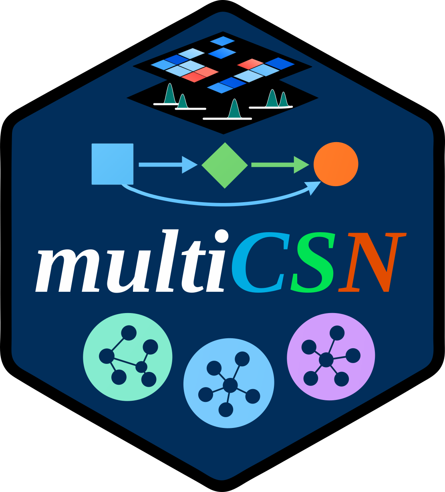

# **multiCSN** 

<!-- badges: start -->

[](https://github.com/mengxu98/multiCSN/blob/main/DESCRIPTION) [](https://github.com/mengxu98/multiCSN/actions/workflows/R-CMD-check.yaml) [](https://github.com/mengxu98/multiCSN/actions/workflows/test-coverage.yaml) [](https://mengxu98.github.io/multiCSN/reference/index.html)

<!-- badges: end -->

## **Introduction**

[multiCSN](https://mengxu98.github.io/multiCSN/) is an R package for **infer**ring **C**ell-**S**pecific gene regulatory **N**etwork from single-cell omics data.


## **Installation**

Install the development version from [GitHub](https://github.com/mengxu98/multiCSN) use [pak](https://github.com/r-lib/pak):

``` r
if (!require("pak", quietly = TRUE)) {
  install.packages("pak")
}
pak::pak("mengxu98/multiCSN")
```

## **Usage**

### **Examples**

### **For a `matrix` object**

``` r
library(multiCSN)
data("example_matrix", package = "inferCSN")

network <- inferCSN(
  example_matrix
)
```

### **For a `matrix` object, initiate it to `Network` object**

``` r
library(multiCSN)
data("example_matrix", package = "inferCSN")

object <- initiate_object(
  example_matrix
)
object
object <- inferCSN(
  object
)

network_table <- export_csn(
  object
)
head(network_table)
```

More functions and usages about [multiCSN](https://mengxu98.github.io/multiCSN/)? Please reference [here](https://mengxu98.github.io/multiCSN/reference/index.html).
